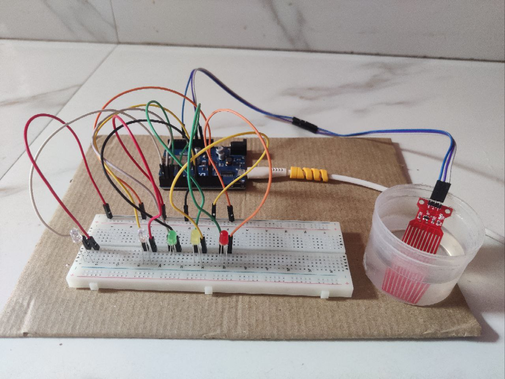
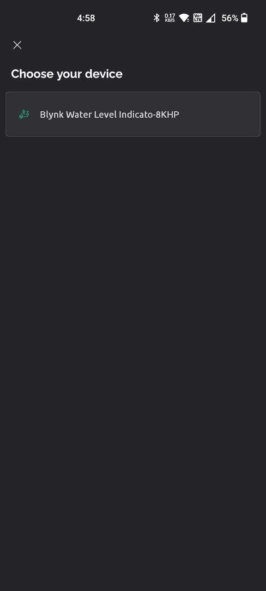
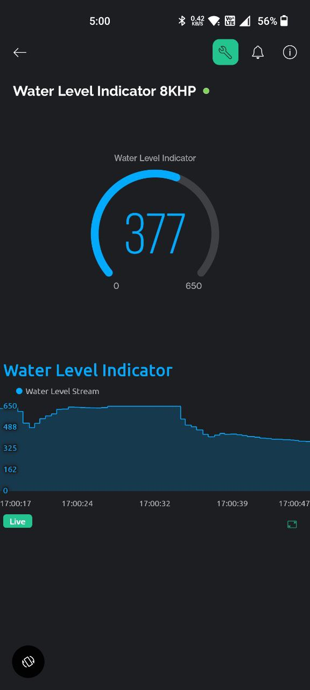

# IoT Water Tank Monitoring System with Mobile App Integration 💧📱

This project demonstrates interfacing water level sensors with an ESP8266 (D1 R1) and controlling LEDs through Wi-Fi using the Blynk app. The LEDs indicate the water level, and the project includes integration with a water level depth detection sensor for precise readings.

 

 

                                   _____________________
                                  |          |          |
                                  |    D2    |    D3    |
                                  |__________|__________|
                                  |          |          |
                                  |    D6    |    D10   |
                                  |__________|__________|            ____________
                                  |          |          |           |            |
                                  |    D1    |    GND   |---------- |  ESP8266   |
                                  |__________|__________|  |        |____________|
                                  |          |          |  |
                                  |    A0    |   3.3v   |  |
                                  |__________|__________|  |
                                      |          |         |
                                      |          |         |
                                      |          |         |         ____________
                                      |          |         |        |            |
                                      |__________|_________|________|   Sensor   |
                                                                    |____________|

- D2, D3, D6, D10: Pins connected to LEDs.
- D1: Pin used to indicate connectivity.
- A0: Analog pin connected to the water level depth detection sensor.
- GND: Ground connection.
- ESP8266: Wemos ESP8266 Wi-Fi Board (D1 R1)
- Sensor: Water Level Depth Detection Sensor

## Setup Steps 🛠️

Follow these steps to set up the circuit:

### 1. Circuit Connection

Connect the components as follows:

- Connect LEDs (3.3V Red, Green, Blue, Yellow LEDs) to pins D2, D3, D6, and D10 on the ESP8266 board.
- Connect pin D1 to indicate network and cloud connectivity.
- Connect the negative (shorter) lead of each LED to the ground (GND) on the breadboard to complete the circuit.
- Connect the water level depth detection sensor to pin A0, GND, and 3.3V on the ESP8266 board.

### 2. Components Required 🧰

You will need the following components:

- **Wemos ESP8266 Wi-Fi Board (D1 R1)**: Microcontroller board.
  - **Specifications**:
    - Microcontroller: ESP8266 (D1 R1)
    - Clock Speed: 80MHz (up to 160MHz)
    - USB Converter: CH340G
    - Operating Voltage: 3.3V
    - Flash Memory: 4MB
    - Digital I/O: 11
    - Analog Inputs: 1
    - Communications: I2C, Serial, SPI
    - WiFi: Built-in
- **LEDs**: For lighting effects.
  - **Specifications**:
    - Type: 3.3V LEDs (Red, Green, Blue, Yellow)
- **Water Level Depth Detection Sensor**: For precise water level readings.
  - **Specifications**:
    - Operating Voltage: DC 3-5V
    - Operating Current: < 20mA
    - Sensor Type: Analog
    - Detection Area: 40mm x 16mm
    - Operating Temperature: 10°C-30°C
    - Humidity: 10% - 90% non-condensing
- **Female, Male to Male Jumper Wires**: For connecting components.

For detailed connections and pinouts, refer to the component directories in the `components` folder.

## Connecting LEDs on Breadboard 🍞💡

To connect LEDs on a breadboard, follow these steps:

1. Insert the LEDs into the breadboard, ensuring the longer lead (positive) is on one side and the shorter lead (negative) is on the other side.
2. Connect the positive (longer) lead of each LED to a digital pin on the ESP8266 board (D2, D3, D6, D10).
3. Connect the negative (shorter) lead of each LED to the ground (GND) on the ESP8266 board.
     

For detailed specifications and connection diagrams of LEDs, refer to the LED component directory in the `components` folder.

## Components 🧩

### Wemos ESP8266 Wi-Fi Board (D1 R1) 💡

This directory contains information about the ESP8266 microcontroller board.

#### Specifications

- Microcontroller: ESP8266 (D1 R1)
- Clock Speed: 80MHz (up to 160MHz)
- USB Converter: CH340G
- Operating Voltage: 3.3V
- Flash Memory: 4MB
- Digital I/O: 11
- Analog Inputs: 1
- Communications: I2C, Serial, SPI
- WiFi: Built-in

For more details, refer to [Wemos ESP8266 Wi-Fi Board (D1 R1) Details](components/ESP8266)

### LED 💡

This directory contains information about the LEDs used in the project.

#### Specifications

- Type: 3.3V LEDs (Red, Green, Blue, Yellow)

For more details, refer to [LED Details](components/LED)

### Water Level Depth Detection Sensor 🌊

This directory contains information about the water level depth detection sensor used in the project.

#### Specifications

- Operating Voltage: DC 3-5V
- Operating Current: < 20mA
- Sensor Type: Analog
- Detection Area: 40mm x 16mm
- Operating Temperature: 10°C-30°C
- Humidity: 10% - 90% non-condensing

For more details, refer to [Water Level Depth Detection Sensor Details](components/WATER_SENSOR)

### Female, Male to Male Jumper Wires 🚀

This directory contains information about the male to male jumper wires used in the project.

For more details, refer to [Jump Wires Details](components/JUMP_WIRE)

### Breadboard 🍞

This directory contains information about the breadboard used in the project.

#### Specifications

- Type: Full-size Breadboard
- Total Holes: 830
- Spacing: 2.54mm (0.1")
- Dimension: 16.5x5.5cm
- Common Rating: 1A @ 5V or 5 Watt

For more details, refer to [Breadboard Details](components/BREAD_BOARD)

## Arduino Software and Blynk App 📱

### Arduino Software

Before uploading the code to the ESP8266 board, make sure you have the Arduino software installed. You can download it from the [Arduino website](https://www.arduino.cc/en/software).

# Blynk App Setup 📱

Blynk is a platform that allows you to build IoT applications easily. Follow these steps to set up Blynk with your ESP8266 project:

## Web Interface Setup

1. Go to the [Blynk website](https://blynk.io/) and sign up for an account.
2. Once logged in, create a new project and select the ESP8266 board.
3. Configure the project settings and choose the appropriate connection type (Wi-Fi).
4. Add widgets to the project dashboard to control the LEDs and monitor connectivity.

## Variable Setup

1. Create virtual pins in your Blynk project to communicate with the ESP8266.
2. Assign each LED and connectivity indicator to a specific virtual pin.

## Arduino Code Configuration

1. Open the Arduino code file [`Water_Tank_Monitoring_System.ino`](code/Water_Tank_Monitoring_System/Water_Tank_Monitoring_System.ino) from this repository.
2. Include the Blynk library and configure the Wi-Fi credentials.
3. Initialize Blynk with your authentication token and connect to the Blynk server.
4. Map the virtual pins to the corresponding LEDs and connectivity indicators.
5. Implement functions to handle LED control, monitor connectivity status, and read data from the water level depth detection sensor.

## Mobile App Configuration

1. Download and install the Blynk app from the [App Store](https://apps.apple.com/us/app/blynk-control-arduino-raspberry/id808760481) or [Google Play](https://play.google.com/store/apps/details?id=cc.blynk).
2. Log in to the Blynk app using your account credentials.
3. Open the project created earlier in the web interface.
4. Configure the app interface by adding buttons, sliders, or other widgets to control the LEDs and display water level readings.
5. Create widgets to display the connectivity status of the ESP8266 and water level readings from the sensor.

## Template Setup

1. Create templates on the Blynk web interface for the project dashboard.
2. Customize the templates with the desired layout and functionality, including widgets for controlling LEDs, displaying water level readings, and monitoring connectivity.
3. Save the templates and ensure they are synchronized with the mobile app.

## Running the Project

1. Connect your ESP8266 board to power and ensure it is connected to the Wi-Fi network.
2. Open the Blynk app on your mobile device and navigate to the project dashboard.
3. Use the widgets to control the LEDs, monitor connectivity, and view water level readings.
4. Test different scenarios and functionalities to ensure proper operation.

## Screenshots 📸

  

  

  
  

  

  
  

  

  
  

## License 📝

This project is licensed under the [MIT License](LICENSE.md). Feel free to use, modify, and distribute this project for educational purposes.

_Disclaimer: This project is intended for educational purposes only and should not be used in production environments without proper testing and validation._
