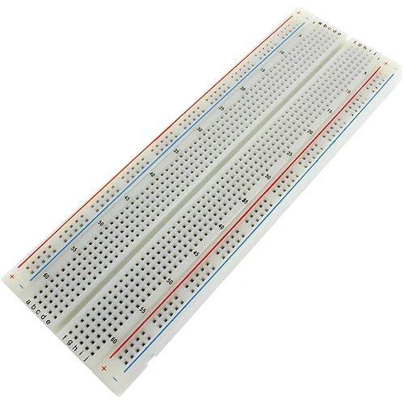

# Breadboard 🍞

This directory contains information about the breadboard used in the project.

## Specifications

- **Type**: Full-size Breadboard
- **Total Holes**: 830
- **Spacing**: 2.54mm (0.1")
- **Dimension**: 16.5x5.5cm
- **Common Rating**: 1A @ 5V or 5 Watt

## Description

The breadboard is a fundamental tool for prototyping electronic circuits. It allows components to be easily connected and rearranged without soldering.

### Where to Buy

You can purchase full-size breadboards from online stores like:

For more details and to purchase, visit [Breadboard on Amazon](https://www.amazon.com/s?k=full+size+breadboard).
