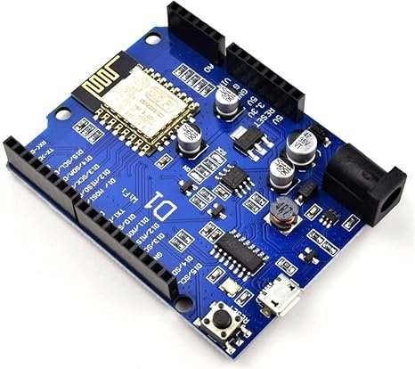

# Wemos ESP8266 Wi-Fi Board (D1 R1) 💡

This directory contains information about the ESP8266 microcontroller board.

## Specifications

- **Microcontroller**: ESP8266 (D1 R1)
- **Clock Speed**: 80MHz (up to 160MHz)
- **USB Converter**: CH340G
- **Operating Voltage**: 3.3V
- **Flash Memory**: 4MB
- **Digital I/O**: 11
- **Analog Inputs**: 1
- **Communications**: I2C, Serial, SPI
- **WiFi**: Built-in

## Description

The Wemos ESP8266 Wi-Fi Board (D1 R1) is a popular microcontroller board widely used for IoT projects. It features a powerful ESP8266 chip with built-in WiFi capability, making it ideal for connecting to the internet and controlling various devices remotely.

### Where to Buy

You can purchase Wemos ESP8266 Wi-Fi Board (D1 R1) boards from online stores like:

For more details and to purchase, visit [Wemos ESP8266 Wi-Fi Board (D1 R1) on Amazon](https://amzn.to/4a1UzbI).
