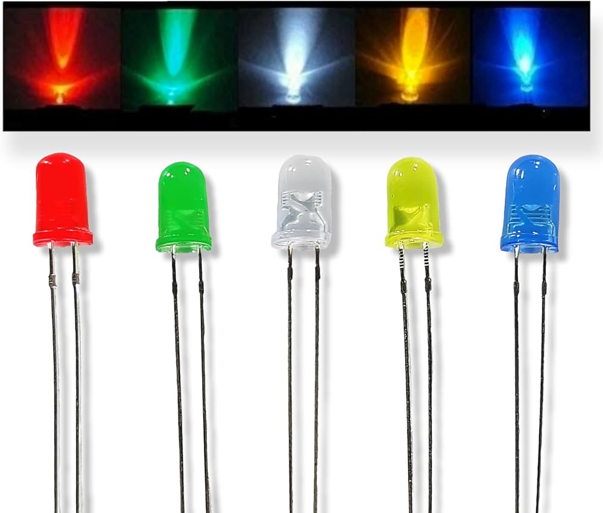

# LED 💡

This directory contains information about the LEDs used in the project.

## Specifications

- **Type**: 3.3V LEDs (Red, Green, Blue, Yellow)
- **Forward Voltage**: 3.3V

## Description

The LED (Light Emitting Diode) is a key component in this project, providing visual feedback. It comes in four colors: red, green, blue, and yellow, each with a forward voltage of 3.3V.

### Where to Buy

You can purchase 3.3V LEDs from online stores like:

For more details and to purchase, visit [LEDs on Amazon](https://www.amazon.com/s?k=3.3V+LEDs).
