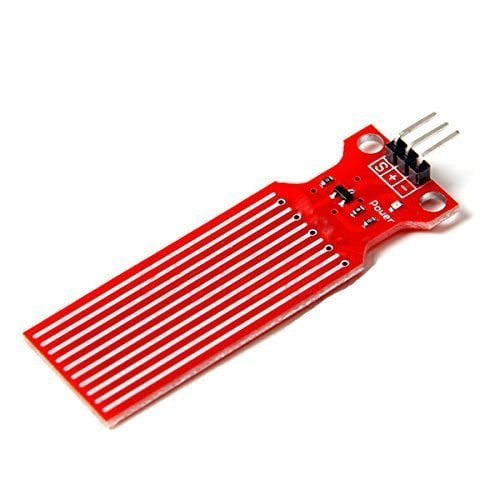

# Water Level Depth Detection Sensor 🌊

This directory contains information about the water level depth detection sensor used in the project.

## Specifications

- **Operating Voltage**: DC 3-5V
- **Operating Current**: < 20mA
- **Sensor Type**: Analog
- **Detection Area**: 40mm x 16mm
- **Operating Temperature**: 10°C-30°C
- **Humidity**: 10% - 90% non-condensing

## Description

The Water Level Depth Detection Sensor is a crucial component of this project, providing precise water level readings. It operates within a voltage range of 3-5V with a low operating current of less than 20mA. The sensor type is analog, and it has a detection area of 40mm x 16mm. It operates optimally within a temperature range of 10°C-30°C and a humidity range of 10% - 90% non-condensing.

### Where to Buy

You can purchase water level depth detection sensors from online stores like:

For more details and to purchase, visit [Water Sensors on Amazon](https://www.amazon.com/s?k=water+level+sensor).
